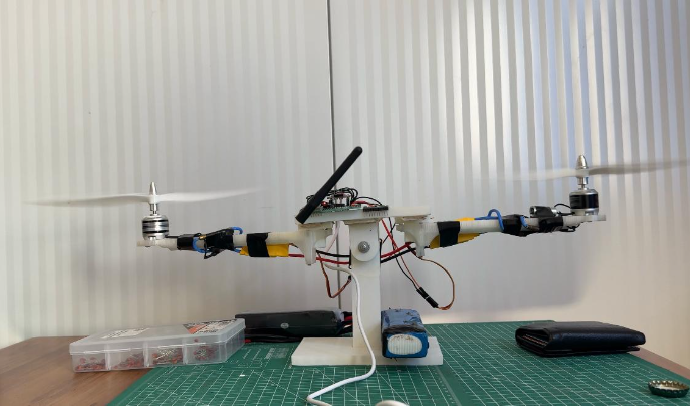
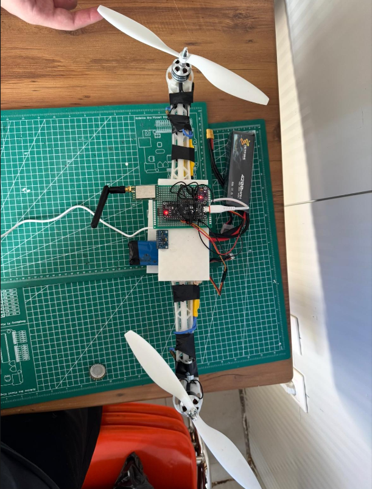
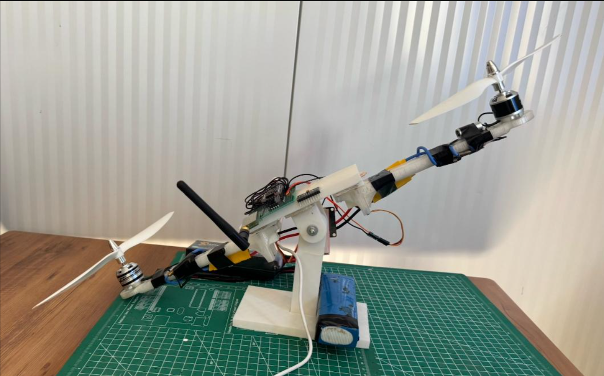
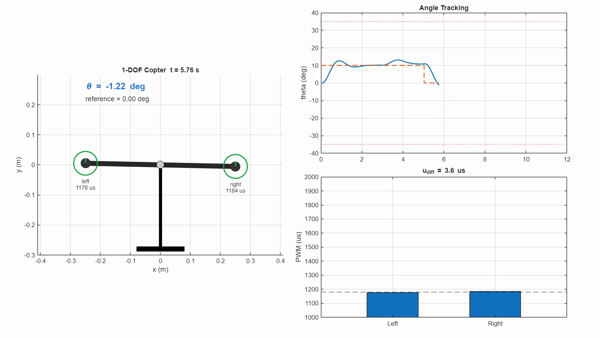
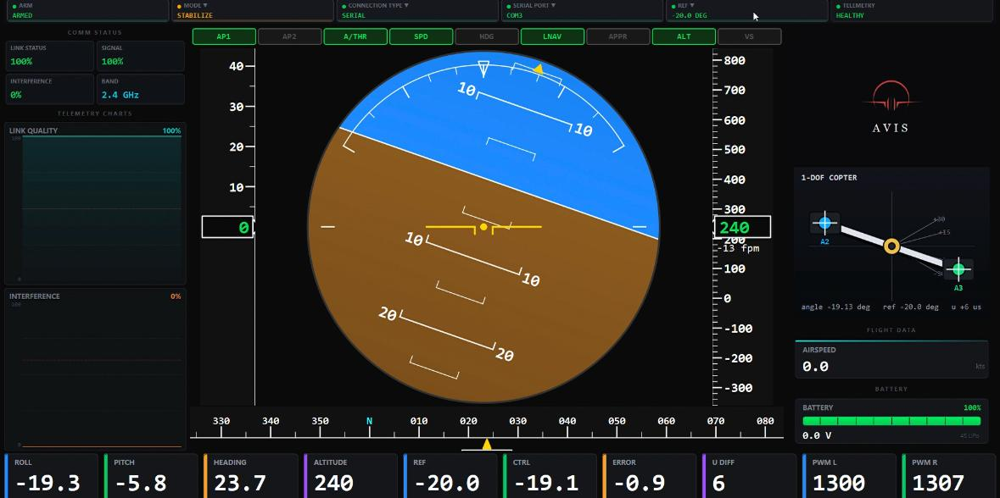

# 1-DOF Copter Flight Control

This repository contains the firmware, desktop interface, MATLAB model, and demo media for a one-degree-of-freedom copter test rig.

The system balances a pivoting beam with two brushless motors. An STM32F401 reads the GY-91 IMU/barometer board, estimates the control angle, runs a PID controller, drives two ESCs with PWM, and streams telemetry to a Python flight-controller interface over USB CDC serial.








## Project Contents

```text
.
|-- firmware/
|   `-- sensor_read_arduino/
|       `-- sensor_read_arduino.ino
|-- interface/
|   |-- main.py
|   |-- main_window.py
|   |-- requirements.txt
|   |-- run.bat
|   |-- run_serial.bat
|   |-- telemetry/
|   |-- utils/
|   `-- widgets/
|-- matlab/
|   |-- init_1dof_params.m
|   |-- run_pso_pid_autotune.m
|   |-- simulate_noisy_pid_response.m
|   |-- export_1dof_copter_video.m
|   `-- output/
|-- media/
|   |-- hardware_test.mp4
|   |-- interface_demo.mp4
|   |-- simulation_motion.mp4
|   `-- images/
|-- tools/
|   |-- flash_stm32_firmware.bat
|   |-- find_stm32_port.ps1
|   |-- run_interface_auto.bat
|   `-- send_stm32_command.ps1
`-- main.m
```

## Hardware Demo


The following video shows the physical test rig captured with a camera during a real run.

<video src="media/hardware_test.mp4" controls muted width="100%"></video>

Video file: [`media/hardware_test.mp4`](media/hardware_test.mp4)

## Hardware Used

- WeAct STM32F401 / BlackPill F401CE board
- GY-91 sensor module
  - MPU9250/MPU6500-based IMU
  - BMP280/BME280 barometer
- 2 brushless motors
- 2 ESCs
- 10x4.5 propeller class used in the MATLAB motor/prop model
- ST-Link programmer
- STM32 USB-C data cable
- External battery or bench power supply
- Mechanical 1-DOF pivot beam test stand

## STM32 to GY-91 SPI Wiring

| GY-91 Pin | STM32 Pin | Purpose |
| --- | --- | --- |
| V3 / 3V3 | 3.3V | Sensor power |
| GND | GND | Common ground |
| SCL | PA5 | SPI1 SCK |
| SDA | PA7 | SPI1 MOSI |
| SDO / SAO | PA6 | SPI1 MISO |
| NCS | PB0 | MPU chip select |
| CSB | PB1 | BMP/BME chip select |

## Motor PWM Wiring

| STM32 Pin | Purpose |
| --- | --- |
| A2 / PA2 | Left ESC signal |
| A3 / PA3 | Right ESC signal |
| GND | Common ground with the ESCs |

The ESC signal wire is not enough by itself. The STM32 ground and ESC ground must be connected together.

## Required Software

### Firmware

- Arduino IDE or Arduino CLI
- STM32duino / STM32 Arduino Core
- STM32CubeProgrammer
- ST-Link drivers

Arduino board settings:

```text
Board: Generic STM32F4 series
Board part number: BlackPill F401CE
Upload method: STM32CubeProgrammer (SWD)
USB support: CDC (generic Serial supersede USART)
USB speed: Low/Full Speed
Baud: 115200
```

### Desktop Interface

- Python 3.10 or newer
- PySide6
- PyOpenGL
- numpy
- pyserial

Install dependencies:

```powershell
cd interface
python -m pip install -r requirements.txt
```

### MATLAB Model

- MATLAB
- Simulink is optional and is only required for `build_1dof_simulink_model.m`
- The core simulation and video export scripts run from MATLAB scripts

## Firmware Upload

Main firmware file:

```text
firmware/sensor_read_arduino/sensor_read_arduino.ino
```

On Windows, with Arduino CLI and STM32CubeProgrammer installed:

```powershell
tools\flash_stm32_firmware.bat
```

The script compiles the Arduino sketch, uploads it over ST-Link/SWD, and then searches for the STM32 USB CDC serial port.

## Desktop Interface

The interface is a Python/PySide6 primary flight display for the 1-DOF copter. It can run with mock data, TCP telemetry, or direct STM32 serial telemetry.

The following video shows the interface receiving serial telemetry from the STM32:



<video src="media/interface_demo.mp4" controls muted width="100%"></video>

Video file: [`media/interface_demo.mp4`](media/interface_demo.mp4)

Run with mock telemetry:

```powershell
cd interface
run.bat
```

Run with STM32 serial telemetry:

```powershell
interface\run_serial.bat
```

Automatically find the STM32 COM port and start the interface:

```powershell
tools\run_interface_auto.bat
```

The interface decodes STM32 binary telemetry in `interface/telemetry/serial_telemetry_client.py`. It can also send ARM/DISARM and reference-angle commands to the STM32 over serial.

## Serial Commands

The firmware supports these serial commands:

```text
ARM,1
ARM,0
DISARM
REF,<degrees>
PID,<kp>,<ki>,<kd>
KAL,<qAngle>,<qRate>,<rAngle>,<rRate>
HOVER,<us>
IDLE,<us>
MOTOR,<left_us>,<right_us>,<ms>
STATUS
```

Example:

```powershell
tools\send_stm32_command.ps1 "STATUS"
```

## MATLAB Simulation

The MATLAB model includes the nonlinear plant, PWM saturation, motor lag, noisy sampled measurements, anti-windup PID control, and a video exporter.

The exported MATLAB animation is shown below:

<video src="media/simulation_motion.mp4" controls muted width="100%"></video>

Video file: [`media/simulation_motion.mp4`](media/simulation_motion.mp4)

Run the complete simulation from the repository root:

```matlab
run('main.m')
```

`main.m` performs these steps:

1. Adds the MATLAB model folder to the path.
2. Loads tuned gains from `matlab/output/tuned_pid_gains.json` when available.
3. Runs the realistic noisy 1-DOF PID simulation.
4. Exports `matlab/output/one_dof_copter_motion.mp4`.

To rerun PSO PID tuning manually:

```matlab
p = init_1dof_params();
result = run_pso_pid_autotune(p);
sim = simulate_noisy_pid_response(result.gains, p);
export_1dof_copter_video(sim, p);
```

## Current Control Settings

Firmware startup PID gains:

```text
Kp = 3.25
Ki = 0.35
Kd = 0.65
```

PWM settings:

```text
minPwm = 1000 us
maxPwm = 2000 us
hoverPwm = 1300 us
armedMinPwm = 1300 us
```

The firmware currently controls the roll axis:

```cpp
#define CONTROL_AXIS_PITCH 0
```

## Safety Notes

- Remove propellers before motor tests.
- Make sure the motor/ESC power supply can provide enough current.
- Connect STM32 GND and ESC GND together.
- Use a mechanical angle stop during early tests.
- Verify sensor sign and motor correction direction before arming.

